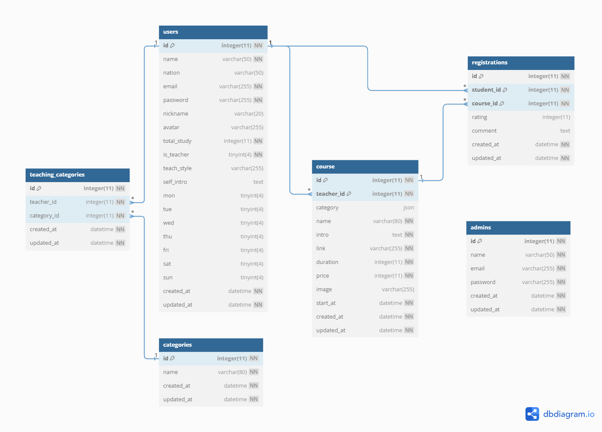

# 

Tutor 是一個可以提供使用者選擇家教的教學平台

網頁(前端): http://34.125.232.84:3030/
API 文件: http://34.125.232.84:3000/api-docs/

以下是由後端架構網頁開發(應用程式)的功能簡介

## 產品功能(Features)

### 1. 首頁
   - 未登入的使用者可以瀏覽首頁，查看學生的學習時數排行，以及家教老師清單
   - 此外使用者也可依照教學類別，或使用關鍵字查詢，來選擇合適的家教老師
   - 當使用者完成登入，可進一步查看完整老師資訊以及預約課程的服務
   
### 2. 一般使用者(學生用戶)
   - 當使用者於平台完成註冊，即享有學生身分
   - 進入首頁，點擊家教老師的`瀏覽更多`按鈕可以瀏覽家教老師的個人資料
   - 進入首頁，點擊`預約課程`按鈕將呈現當週老師開設課程時端，供學生挑選並進行課程預約
   - 點擊右上方頭像，進入`個人檔案`，使用者可以編輯`姓名`、`大頭照`、`自我介紹`
   - 點擊右上方頭像，進入`我的課程`，可查看所有完成預約的課程行事曆，並對已完成的課程可進行評分及評論
   - 若預約課程的時間在今天以後，可以`取消預約`

### 3. 申請成為老師(老師用戶)
   - 使用者登入後，預設為學生身分，點擊`成為老師`按鈕，填寫表單，即具老師身分
   - 點擊右上方頭像，進入`個人檔案`，點擊`授課時間`右方的`鉛筆圖示`，周曆下方會顯示`+`，開始進行新增課程
   - 點擊右上方頭像，進入`我的課程`，可以瀏覽老師的`課程行事曆`，會依照時間顯示所有開設的課程，確定自己開設的課程是否有學生預約
   - 老師可以切換為學生身分，即可預約課程

### 4. 後台：
   - 只有管理者可以瀏覽後台，查看`使用者清單`

## 測試帳號

### 1. 學生：
   - 帳號：user1@example.com
   - 密碼：12345678
  
### 2. 老師：
   - 帳號：teacher1@example.com
   - 密碼：12345678
  
### 3. 管理員：
   - 帳號：root@example.com
   - 密碼：12345678

## 後端

### 系統架構

### 資料庫架構(ERD)

## Demo

### 1. 使用者瀏覽首頁

<video src="https://github.com/yuan6636/capstone-tutor-backend/assets/142104301/1c44ccba-e8c6-49a9-9895-41f12dfa0d0a">
  Your browser doesn't support embedded video.
  
</video>

### 2. 使用者註冊/登入

<video src="https://github.com/yuan6636/capstone-tutor-backend/assets/142104301/0ac2f045-c0f1-4c93-876d-657ef2d1266f">
  Your browser doesn't support embedded video.
  
</video>

### 3. 學生成為老師

<video src="https://github.com/yuan6636/capstone-tutor-backend/assets/142104301/4b9e952e-c7a4-4088-8b5f-100f98dfb92b">
  Your browser doesn't support embedded video.
  
</video>

### 4. 學生使用tutor

<video src="https://github.com/yuan6636/capstone-tutor-backend/assets/142104301/3e22a952-ce79-4ba7-bd2e-3ca702129e7f">
  Your browser doesn't support embedded video.
  
</video>

### 5. 老師使用tutor

<video src="https://github.com/yuan6636/capstone-tutor-backend/assets/142104301/f7ae9022-26bf-45b8-85ae-6b68643b4adf">
  Your browser doesn't support embedded video.
  
</video>

### 6. 後台

<video src="https://github.com/yuan6636/capstone-tutor-backend/assets/142104301/7231c20a-078d-473d-91cf-9a01d7a03bb4">
  Your browser doesn't support embedded video.
  
</video>

## 專案畫面

### 首頁

### 以學生身分瀏覽我的檔案

### 以學生身分瀏覽我的課程

### 以老師身分瀏覽我的檔案

### 以老師身分瀏覽我的課程

### 開發環境

- [Node.js v18.15.0](https://nodejs.org/en)

### 框架

- [Express v4.18.2](https://expressjs.com/)

### 資料庫

- [MySQL v8.0.15](https://downloads.mysql.com/archives/installer/)

### Team

 - Front-end - [Elaine](https://github.com/yuri1022)
 - Front-end - [Kai](https://github.com/enternalsong) 
 - Back-end - [Chris](https://github.com/yuan6636)
 - Back-end - [Tommy](https://github.com/Tommy0901)
 - UI/UX - 北極 - [北極](https://github.com/judy-code)